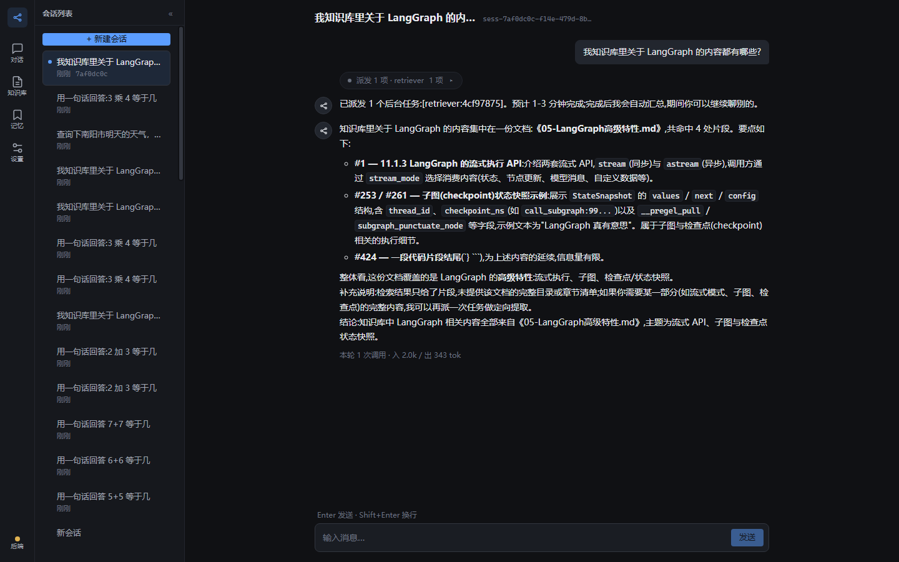
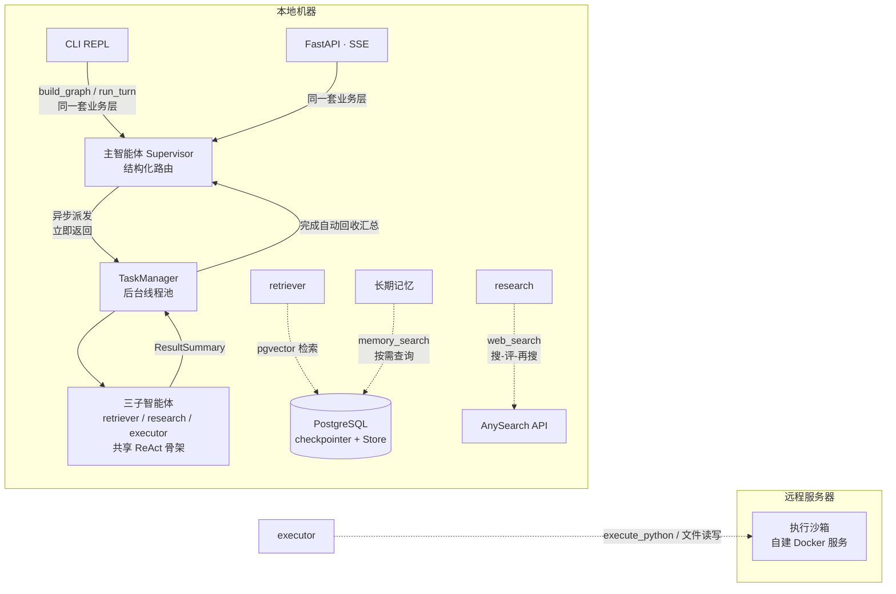
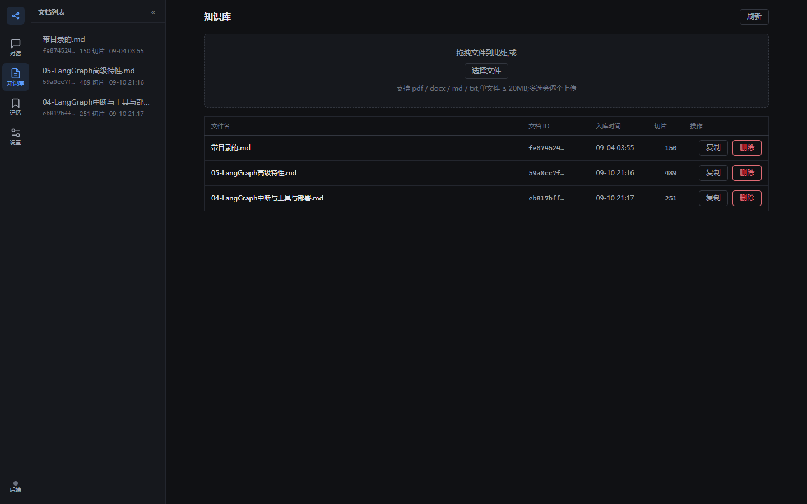
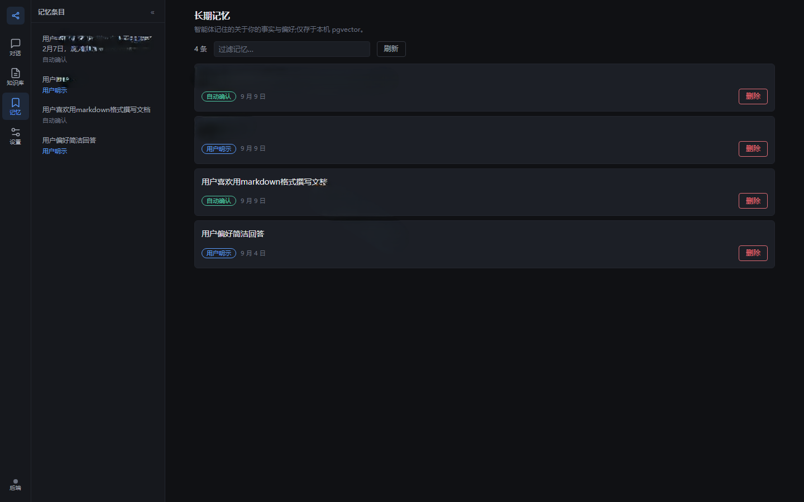
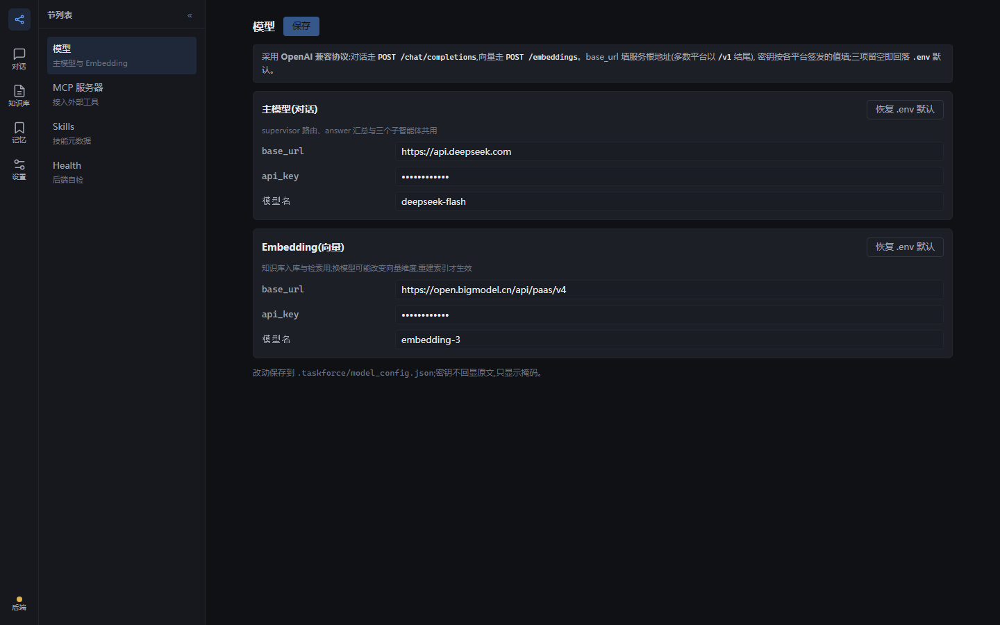
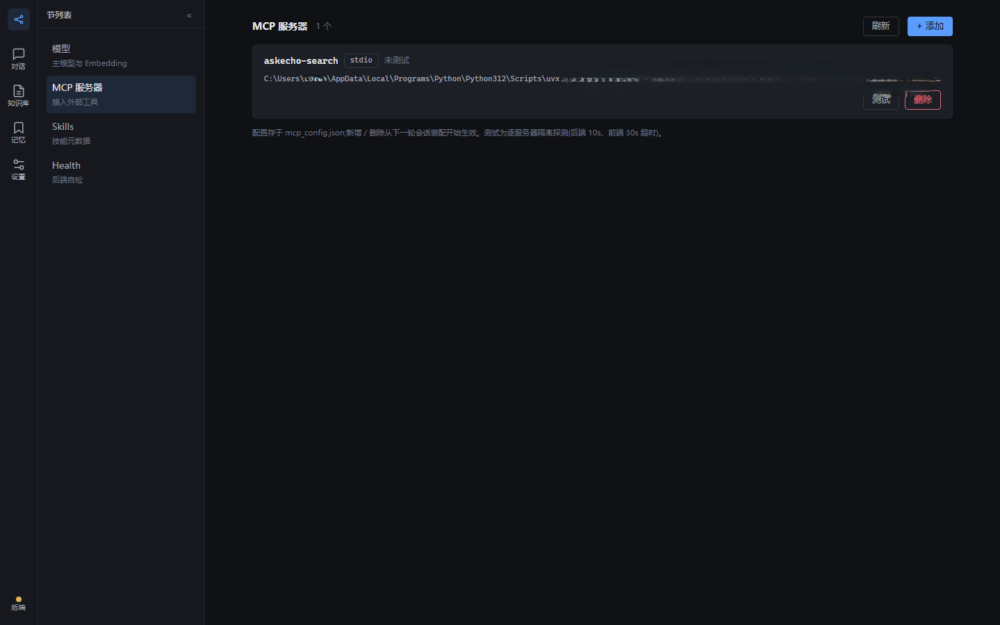

# TaskForce

**基于 LangGraph 的个人 Agent 工作台:知识库问答、联网调研、沙箱代码执行,CLI / HTTP API / Web 工作台三入口。**

面向实习求职的项目经历。单用户本地部署,Windows 开发机,uv 管理,Python 3.12。

一次派发多个子智能体、后台并行执行、完成后自动汇总(无需再问):



## 技术栈

| 层 | 选型 |
|---|---|
| **编排** | LangGraph 1.x:主图(supervisor 结构化路由 + answer/ask/memory)+ 3 个 ReAct 子图;`Send` 动态 fan-out、`interrupt` 单点 HITL、Postgres checkpointer / Store |
| **模型** | 全部走 **OpenAI 兼容协议**:LLM(火山方舟豆包 / DeepSeek)、Embedding(智谱);base_url / api_key / 模型名可在设置页改,不锁死在代码里 |
| **后端** | FastAPI(七 router;**全同步 `def` 端点**,由 FastAPI 丢线程池,零 async)+ SSE 同步 generator + Pydantic v2 |
| **存储** | PostgreSQL + pgvector:会话 checkpoint、长期记忆 Store、文档向量;**BM25 + 向量双路召回 + RRF 融合**(中文分词 jieba) |
| **工具能力** | 内置文件读写工具 + MCP(stdio / streamable-http 双协议,失败降级)+ Skills 渐进式加载 + AnySearch 联网 + 远程 Docker 沙箱执行 |
| **前端** | Vue 3.5 `<script setup>` + TypeScript strict + Vite 7 + Pinia + vue-router(hash)+ **原生 CSS 设计令牌,零 UI 库**;SSE 走 fetch + ReadableStream 手工分帧 |
| **工程** | uv(依赖与运行)、hatchling(src 六包)、ruff、pytest、vitest / vue-tsc、docker compose |

## 架构



控制面在本地、**执行面在远程沙箱**:本仓库不内置任何执行环境,只做 `execute_python` 工具接入(HTTP + Bearer)。

## 界面

| 知识库:上传 / 防重 / 切片管理 | 记忆:用户事实与偏好,可检索可删 |
|---|---|
|  |  |

| 设置 · 模型:接入信息可视化配置(密钥掩码回显) | 设置 · MCP:双协议服务器管理与连通性测试 |
|---|---|
|  |  |

## 功能清单

- [x] 多智能体:supervisor 结构化路由 + retriever/research/executor 三子智能体(统一 ReAct 骨架)
- [x] 异步派发:任务提交后台线程池,派发即返回可继续交互;全批完成自动汇总推送(不阻塞、无需询问)
- [x] 知识库 RAG:pdf/docx/md 上传解析、内容级防重、BM25 + 向量混合检索(RRF 融合)、切片管理
- [x] 联网调研:AnySearch API 直连,搜-评-再搜循环,来源引用
- [x] 沙箱代码执行:远程 Docker 执行 Python + 工作区文件读写
- [x] Skills 渐进式加载:元数据注入主智能体,全文由 executor 按需读取
- [x] MCP 工具接入:stdio(本地)+ streamable-http(远程)双协议,失败降级
- [x] 长期记忆:用户事实/偏好,memory_search 按需检索,仅注入主智能体
- [x] 统一 HITL:ask 问询与记忆确认两个挂起点,任意时刻至多一个挂起
- [x] 会话持久化:Postgres checkpointer,`/resume` 换线程续聊;历史消息回填与骨架屏
- [x] 模型配置可视化:设置页「模型」节可改主模型 / Embedding 的 base_url、api_key、模型名(密钥掩码回显,保存后重启后端生效)
- [x] 双入口:CLI REPL 与 FastAPI SSE 共用同一 `build_graph` / `run_turn`
- [x] 用量统计:按轮增量角标 + 进程累计,`/stats` 查看

## 五分钟起步

```bash
docker compose up -d                  # 起 PostgreSQL + pgvector(映射 5433)
cp .env.example .env                  # 填 LLM / Embedding;数据库串默认已对上 compose
cp mcp_config.example.json mcp_config.json   # 可选:MCP 服务器(示例是占位,按需改)
cp agents.example.md agents.md        # 可选:个人背景与全局指令(示例是占位,按需改)
uv sync                               # 安装依赖
uv run python -m cli.repl             # CLI 入口
```

Web 工作台(前端在 `dev/front/`,Vue 3 + Vite;生产形态由 FastAPI 同源托管):

```bash
cd dev/front && npm install && npm run build   # 第一次:装依赖并出构建产物
cd ../.. && uv run uvicorn api.main:app --port 8010   # 打开 http://127.0.0.1:8010
```

开发前端时用双进程(前端 5173,`/api` 由 vite proxy 剥前缀转发):`cd dev/front && npm run dev`。

> **端口约定:后端固定 `8010`,不换端口。** 本机 `127.0.0.1:8000` 是沙箱通道(`.env` 的 `SANDBOX_URL`,SSH 隧道转发到远程沙箱),
> 与后端同端口会让沙箱自检打到前端服务上、自指递归拖慢整个服务。**8010 被占用时先停掉占用进程再起**:
> `Get-NetTCPConnection -LocalPort 8010 -State Listen | ForEach-Object { Stop-Process -Id $_.OwningProcess -Force }`

> **密钥与个人信息不入库**:`.env`(LLM / Embedding / 数据库 / 沙箱 / 搜索)、`mcp_config.json`(MCP headers)
> 与 `agents.md`(常含真实姓名/年龄/身份)都在 `.gitignore` 里,
> 仓库只提供 `.env.example` / `mcp_config.example.json` / `agents.example.md` 占位模板;本地状态(`.taskforce/`:当前会话、模型覆盖)同样不入库。

一条命令跑测试:`uv run pytest -q && uv run ruff check .`;前端:`cd dev/front && npm run test && npx vue-tsc --noEmit`。
(当前:后端 236 passed / 前端 179 passed,2026-09-18)

## 目录

```
src/
├── agent/      # 主图(supervisor/answer/ask/memory)+ subagents/(三子图)+ contracts/
├── tools/      # tool/ skills/ mcp/ sandbox/ websearch/ rag/
├── prompts/    # 全部提示词(md 数据包,占位符 $name)
├── settings/   # config / loader / usage / session / db/
├── api/        # FastAPI 七 router(chat/models/knowledge/memory/skills/mcp/health)
└── cli/        # REPL(context/streaming/commands)
dev/front/      # Web 工作台(Vue 3 + Vite + Pinia,独立工程:不进 uv / hatchling / pytest)
docs/           # 设计文档 / ADR / 开发文档 / 演示剧本 / 界面截图(images/)
```

## 设计决策

**1. 为什么用子智能体而不是工具?**
长任务需要独立上下文、可并行、结构化回传。子图各自维护私有 ReAct 循环,只回传 ResultSummary,supervisor 是唯一叙事者——避免把多智能体压扁成"一个带一堆工具的 LLM"。

**2. 多智能体带来了什么?**
"对比 LangGraph 与 CrewAI 并结合我的笔记"一次派 2×research + 1×retriever 后台并行执行;派发即返回,主智能体继续响应用户;任务完成后自动汇总(用户询问进行中则等答完再推送);结果冲突时由 answer 明示并说明采信理由。

**3. 不用 async 怎么并行?**
派发与子图执行走线程池(IO-bound 等待释放 GIL),完成事件经回调唤醒监视线程(Web 端由前端轮询 peek 端点触发汇总);全同步代码(无 async/await)降低心智负担,SSE 用同步 generator 喂 StreamingResponse。

**4. 为什么沙箱在远程?**
ADR-0007:执行面隔离,本地零污染。本仓库只做 `execute_python` 工具接入(HTTP + Bearer),不内置任何执行环境。

**5. HITL 为什么只挂两处?**
interrupt 只在 ask(问询)与 memory(确认)节点,任意时刻至多一个挂起(ADR-0008),REPL 与 API 同一套恢复语义。

## 刻意不做(取舍理由)

| 不做 | 理由 |
|---|---|
| 多用户 / JWT | 单用户本地工作台,表结构已预留 user_id 待扩展 |
| 时间旅行 `/rewind` | LangGraph 原生能力,但与记忆语义冲突,演示价值低 |
| Langfuse tracing | 本地工具量级可控,不引入观测平台 |
| rerank 模型 | 混合检索 + RRF 在单用户知识库规模下已够用 |
| 对话摘要压缩 | 全量保留 + 超阈值告警,压缩收益不抵实现复杂度 |
| 动态工具选择 | 工具集固定且小,白名单预筛已足够 |
| 敏感信息打码 | 单用户本地,无多租户泄露面 |

详细设计见 [docs/DESIGN.md](docs/DESIGN.md);演示剧本见 [docs/demo-scripts.md](docs/demo-scripts.md);前端设计与开发文档见 [dev/front/docs/](dev/front/docs/)。
