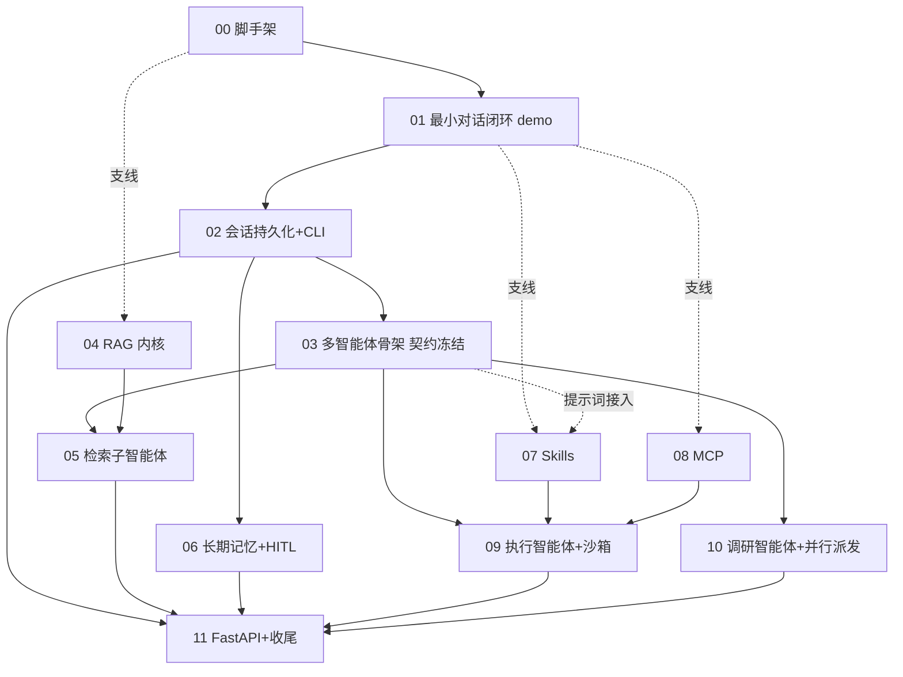

# TaskForce 开发路线图(ROADMAP)

> 本文档是**开发进度的唯一事实源**。设计意图见 `docs/DESIGN.md`,上下文与提示词设计见 `docs/PROMPT-DESIGN.md`,架构决策见 `docs/adr/`,术语见根目录 `CONTEXT.md`。
> 状态图例:🔲 未开始 | 🔨 进行中 | ✅ 完成 | ⏸ 阻塞(注明原因) | ♻️ 返工

## 1. 模块总表

| 编号 | 模块 | 文档 | 依赖 | 状态 | 工时 | 备注 |
|---|---|---|---|---|---|---|
| 00 | 脚手架与基础设施 | [DEV.md](00-bootstrap/DEV.md) | - | ✅ | 2h | config/db/联调全部验收通过 |
| 01 | 最小对话闭环(**最小 demo**) | [DEV.md](01-minimal-agent/DEV.md) | 00 | ✅ | 3h | 单节点图 + REPL 流式 + usage;get_state 无 checkpointer 崩溃已修(chunk 攒整兜底) |
| 02 | 会话持久化 + CLI 骨架 | [DEV.md](02-persistence-cli/DEV.md) | 01 | ✅ | 3h | checkpointer / thread_id / /new /resume /stats;3.x 需自建 ConnectionPool(autocommit);2026-09-04 决议:启动改开新会话(旧会话 /resume)+ /list_session |
| 03 | 多智能体骨架(**契约冻结**) | [DEV.md](03-graph-skeleton/DEV.md) | 02 | ✅ | 3h | 七节点图 + Send 并行 + 消费即清 + recursion_limit 兜底;实测修正:Send 须包 Command(goto=[])、主图移除 contract 共享键(并行冲突)、supervisor 注入桩结果防乒乓(见 troubleshooting/03) |
| 04 | RAG 内核 + 知识库管理 | [DEV.md](04-rag/DEV.md) | 00 | ✅ | 4h | parse/split/embed/RAGStore/pgvector;维度断言实测生效;psycopg3 executemany 须在 cursor 上 |
| R | **ReAct 架构改造(插队,最高优先级)** | [react-refactor-plan.md](react-refactor-plan.md) | 03, 04 | ✅ | 8h | T1-T9 全部完成:kb_search/react.py/retriever 重写/service 白名单;实测修正:直挂同键名即共享,子图消息键改 react_msgs(ADR-0010 红线 2);T8 真模型黄金剧本验收通过(隔离库 hits=11);51 tests 全绿 |
| 05 | 检索子智能体 | [DEV.md](05-retriever-subagent/DEV.md) | 03, 04 | ✅ | 3h | 第一个真实子图(ReAct 循环 + kb_search),按模块 R ReAct 模式完成(原三节点管线作废重写) |
| 06 | 长期记忆 + 统一 HITL | [DEV.md](06-memory-hitl/DEV.md) | 02 | ✅ | 7h | ADR-0011 重构后落地:固定 system + 记忆工具化(memory_search/store_memory);ask/memory 双 interrupt 全链路 + /confirm 重启可恢复;5 条实踩坑位沉淀(流式 JSON 泄漏等) |
| 07 | Skills 渐进式加载 | [DEV.md](07-skills/DEV.md) | 01, 03 | ✅ | 2h | SkillRegistry(frontmatter 解析/重名报错/失败跳过)+ $skills_meta 注入 supervisor 与 answer 两侧 + /skills 命令;附带 REPL 原子化拆分(context/streaming/commands) |
| 08 | MCP 接入 | [DEV.md](08-mcp/DEV.md) | 01 | ✅ | 3h | 两层描述 + 单服务器失败降级;范围扩展:union 模型支持 stdio + streamable-http 双协议(远程 MCP 提前落地);REPL 冒烟全流程通过 |
| 09 | 执行智能体 + 沙箱接入 | [DEV.md](09-executor-sandbox/DEV.md) | 03, 07, 08 | ✅ | 5h | 沙箱工具组(协议实测对齐,无 session_id)+ executor ReAct 子图(三层工具装配 + warnings 执行效应)+ mcp_meta 注入 answer;真模型 CSV 统计=166 全链路验收通过 |
| 10 | 调研智能体 + 并行派发 | [DEV.md](10-research-parallel/DEV.md) | 03 | ✅ | 7h | web_search 直连 AnySearch API(替代 ddgs,snippet 截断内聚工具内);research ReAct 子图(搜-评-再搜,8 轮上限 + 16k 字符上下文闸门进共享骨架);Send 多任务 fan-out(MAX_PARALLEL_SUBAGENTS=3 提示词+代码双约束,recursion_limit 25→40);真模型黄金剧本验收;2026-09-11 异步派发(方案 A):dispatch 改 TaskManager 后台线程,主图不再阻塞 |
| 11 | FastAPI 6-router + 收尾 | [DEV.md](11-api-finalize/DEV.md) | 02, 05-10 | ✅ | 5h | 六 router(chat SSE / knowledge / memory / skills / mcp / health);HITL 恢复端点;159 测试 + ruff 全绿;README(架构图/起步/刻意不做/五道设计决策)+ .env.example + 5 条演示剧本 |

合计约 **47h**(不含演示打磨)。**按编号 00->11 顺序执行即天然满足全部依赖**;04 / 07 / 08 是可插空支线。

## 2. 模块依赖图

主线(严格串行):`00 -> 01 -> 02 -> 03 -> 05 -> 06 -> 09 -> 10 -> 11`;支线 04/07/08 挂在主链早期节点上,任意穿插。

## 3. 最小 demo 路径(用户硬要求)

**定义**:依赖装好、LLM 连上,在 REPL 输入一条消息并收到流式回复,usage 有打点。无子图、无记忆、无 RAG、无 API。

**最快路径**:`git clone -> uv sync -> 填 .env(LLM 三件套)-> 模块 00(2h)-> 模块 01(3h)-> REPL 第一条消息`。约 **5 小时**;环境顺利(LLM key 就绪、跳过 DB 部分,PG 留到 02)可压到 **3.5 小时**。后续模块只在此之上叠加,不重构这条链。

## 4. 并行/串行调度

- **绝对串行**:`00 -> 01 -> 02 -> 03`(约 11h)。这是全部后续工作的地基与契约冻结点。
- **契约冻结(03)之后**:05/06/09/10 可按任意顺序推进(编号序即推荐序)。
- **可插空支线**:04(仅依赖 00)、07(核心依赖 01,提示词接入需 03)/08(仅依赖 01)、09 的 sandbox 客户端、10 的 research 循环核心。遇到外部阻塞(等 API key、等沙箱部署、MCP 联调)时优先推支线,**主线永远不阻塞在外部依赖上**。

## 5. 与原四阶段里程碑的映射

| 原阶段 | 模块 | 工时 |
|---|---|---|
| 阶段 1 地基+单智能体 | 00 + 01 + 02 | 8h |
| 阶段 2 RAG+检索子智能体 | 03 + 04 + 05 | 10h |
| 阶段 3 记忆+HITL+Skills+MCP+沙箱 | 06 + 07 + 08 + 09 | 17h |
| 阶段 4 调研+并行+收尾 | 10 + 11 | 12h |

## 6. 契约归属表(一契约一定义处,其余一律 import)

| 契约 | 定义模块 | 定义位置 | 消费模块 |
|---|---|---|---|
| `Settings` / `get_settings()`(LLM/Embedding/DB/沙箱配置 + 启动断言) | 00 | `settings/config.py` | 全部 |
| psycopg 连接辅助(幂等建扩展) | 00 | `settings/db/base.py` | 04, 06 |
| `build_graph(llm, checkpointer)` / `make_llm()`(图的唯一构建入口) | 01 | `agent/build.py` | 01-10、11 |
| `run_turn()`(单轮业务层,CLI 与 API 共用) | 01 | `agent/service.py` | 02+、11(SSE 包装) |
| `UsageTracker`(usage 打点与 /stats) | 01 | `settings/usage.py` | 02+、11 |
| checkpointer 工厂(连接池 + setup 幂等) | 02 | `settings/db/checkpointer.py` | 03+、11 |
| `SessionStore`(thread_id 本地持久化) | 02 | `settings/session.py` | 02、11 |
| `AgentState`(messages + subagent_results reducer) | 03 | `agent/state.py` | 03, 05, 09, 10, 11 |
| `Route` / `Task`(结构化路由 schema) | 03 | `agent/contracts/route.py` | 03 |
| `TaskContract`(任务契约四件套类型) | 03 | `agent/contracts/task_contract.py` | 03(构造)、05/09/10(消费) |
| `ResultSummary`(结果摘要 schema) | 03 | `agent/contracts/summary.py` | 03(answer 读/清)、05/09/10(写) |
| `build_contract()`(会话 -> 契约的纯函数) | 03 | `agent/supervisor.py` | 03 内部(dispatch) |
| `load_prompt(name, **slots)`(md 提示词加载与渲染) | 03 | `settings/loader.py` | 03+、05、06、09、10 |
| RAG 检索接口(`search/upload/delete/list_docs`) | 04 | `tools/rag/store.py` | 05(retriever 子图)、11(/knowledge) |
| `kb_search(query, top_k=5)` 检索工具(去重+截断内聚) | R | `tools/rag/kb_search.py` | 05(retriever) |
| `build_react_subgraph(...)`(ReAct 循环共享骨架) | R | `agent/subagents/react.py` | 05, 09, 10 |
| 长期记忆 Store 工厂(PG + pgvector) | 06 | `settings/db/store.py` | 06、11 |
| `SkillRegistry`(Skill 注册/渐进加载) | 07 | `tools/skills/loader.py` | 03(元数据注入)、09(executor) |
| MCP 工具提供器(索引常驻 + 按需详情 + 降级) | 08 | `tools/mcp/client.py` | 09(executor) |
| 沙箱工具组(`execute_python(code, timeout)` / `write_file` / `read_file` / `list_files`) | 09 | `tools/sandbox/client.py` | 09(executor)、`tools/tool/files.py` |
| 内置文件工具(`read_file`/`write_file`/`list_files`,操作沙箱工作区) | 09 | `tools/tool/files.py` | 09(executor) |

## 7. 契约变更登记

> 任何模块要改动他人契约(签名/字段/接口)前,先在此登记,评审后再改代码。

| 日期 | 契约 | 变更内容 | 影响模块 | 状态 |
|---|---|---|---|---|
| 2026-08-31 | 全部契约路径 | 项目结构改为 src 六包布局(agent/tools/prompts/settings/api/cli),提示词改为 md 文件经 `settings/loader.py` 加载 | 全部 | ✅ 已同步文档 |
| 2026-09-01 | 主图提示词结构 | `$subagent_results` 从 supervisor 系统提示词挪到 answer 调用的消息流(前缀缓存友好);supervisor.md 仅剩 `$skills_meta`/`$memory` 两个插槽;PROMPT-DESIGN §1.1 第 6 段语义同步此登记 | 03/05/09/10 | ✅ supervisor.md 已改 |
| 2026-09-02 | 主图上下文策略 | **滑动窗口作废**(ADR-0009 R1):路由/汇总均全量保留 messages,删 SLIDE_WINDOW/sliding_messages;"压缩上下文"排入 backlog(优先级提升);过渡期 service.py 加超阈值日志告警 | 03/11 | ✅ PROMPT-DESIGN §1.2/§4.2 已标作废 |
| 2026-09-02 | 防死循环机制 | 自数步数(MAX_STEPS/route_marker/哨兵消息)作废,改用 LangGraph 原生 `recursion_limit`(config 顶层键,初值 25)+ `run_turn` 捕获 `GraphRecursionError` 返回诚实兜底消息(ADR-0009 §2 争议 B) | 03/11 | ✅ 已同步 03-DEV |
| 2026-09-02 | 子图接入方式 | 桩子图从"单函数假桩/wrapper 写死"改为**真实编译 StateGraph**;首选**共享键直挂**(`contract`/`subagent_results` 共享键 + `add_node(编译图)` + `Send(子图名, {"contract": ...})`,03 第 0 步最小实验验证);失败降级 wrapper 并登记三项代价(checkpoint 不共享/流式不保证/异常不传播);新增 `SubgraphContract` 契约与 `max_parallel_subagents`(初值 3)(ADR-0009) | 03/05/09/10 | ✅ 已同步 03/05/09/10-DEV |
| 2026-09-02 | AgentState.contract 键 | 主图**移除** `contract` 键:共享键直挂仅需 `subagent_results`;`contract` 由 Send payload 直达子图,主图不声明(实测:并行多子图写回 contract 触发 InvalidUpdateError,ADR-0009 第 0 步实验延伸发现) | 03 | ✅ 已同步 state.py |
| 2026-09-02 | ResultSummary.agent 命名 | **"retrieval" 统一为 "retriever"**(与 Route.Task.agent / 子图节点名 / supervisor.md 能力清单一致,消除同名智能体两套命名的矛盾;DEV.md/PROMPT-DESIGN.md 同步修正) | 03/05/10 | ✅ 已同步 summary.py / stub.py / build.py / tests / 文档 |
| 2026-09-02 | ResultSummary.task 上限 | 删除 `max_length=100`:task 是 supervisor 自由生成文本的回显,长度不可控,加会上限会在子图边界抛 ValidationError 崩掉整轮(已实测复现);`conclusion` 的 100 上限保留(决策字段) | 03/05/09/10 | ✅ 已同步 summary.py + 回归测试 |
| 2026-09-04 | 子智能体执行模式 | **三子智能体统一 ReAct 工具循环**(ADR-0010):手写循环共享骨架 `agent/subagents/react.py`(05/09/10 复用);retriever 检索能力封装为 `kb_search` 工具(去重+截断内聚),查询改写由 LLM 多轮调工具涌现;RetrieverState 增私有键 messages(add_messages)/hits/iteration;05 已实现三节点管线作废重写;supervisor 保持结构化路由不变;契约 schema 冻结不变(data={"hits":...} 行为形状保持);防失控改双层(子图自数 max_iterations + 主图 recursion_limit 兜底,ADR-0009 §2B v3 补注) | 05/09/10 | ✅ 已完成(模块 R 全量验收通过) |
| 2026-09-10 | 沙箱工具契约 | `execute_python(code, session_id)` → `execute_python(code, timeout)`:实测用户沙箱(09-DEV §1 前提"协议以实际为准")为**无状态**执行(每次新建容器),无 session_id 概念;且出参无 files 字段,文件走独立端点 `/files/write`、`/files/read`(无列目录端点,list_files 用 execute_python 跑 os.listdir 实现,实测工作区挂载进容器可见);工具组统一"不抛异常,结构化 {ok, error}"返回 | 09/11 | ✅ 已同步 ROADMAP §6 |
| 2026-09-04 | RAGStore.upload 返回值 | `str` → `tuple[str, bool]`(doc_id, created):新增内容级防重——documents 加 content_hash(解析后文本统一换行+strip 的 SHA-256)+ (user_id, content_hash) 唯一索引,重复上传复用已有文档且不再切块/向量化;存量旧数据不回填(用户决议,content_hash 为 NULL 不参与判重);消费方 rag/cli 与 REPL /kb 已同步 | 04/05/11 | ✅ 已同步 store/cli/repl/tests |
| 2026-09-04 | 主智能体上下文结构 | **固定 system + 动态 messages**(ADR-0011):① agents.md 全文/记忆 top-5/子结果从 system 移出——agents.md 只在 answer/ask 侧、构建期装配一次,记忆改 `memory_search`/`store_memory` 工具(按需调用,ToolMessage 进消息流),子结果改结构化资源消息(不再占 HumanMessage 角色);② 路由(supervisor)prompt 精简为轻量 router,不再注入 agents.md/记忆正文;③ prompt caching 从"明确不做"改"静态前缀工程化"(P0);④ store 改 `graph.compile(store=...)` 注入,user_id 入 settings | 03/06/11 + 文档 | ✅ 已同步 PROMPT-DESIGN §1.1/§4.2、DESIGN §3、ADR-0011、ARCH-REVIEW.md;核心已落地(固定 system + 记忆工具化 + cache 观测 + 超阈值告警,74 tests 绿,真模型端到端验证 memory_search 命中);store 注入方式与 user_id 入 settings 排 backlog |
| 2026-09-14 | RAGStore.search score 语义 | **score 从"余弦距离,越小越近"翻转为"RRF 融合分,越大越相关"**:纯 pgvector → BM25+向量双路召回 + RRF 融合(方案 A,任务见 docs/improved/rag_improve_v1/)。新增 `tools/rag/bm25.py`(tokenize 双端共用 / Bm25Index 内存索引懒加载+脏标记+双检锁 / rrf_fuse 排名并集融合);`store.search` 拆 `_search_vector`(向量路,SQL 补 `c.id AS chunk_id`)与关键词路,`rrf_fuse` 取 top_k,关键词路独占命中 `_fetch_chunks` 回填;upload/delete 后置脏(懒重建,存量零迁移)。返回 dict **新增 `chunk_id` 键**(只增不改)。消费方:kb_search 仅透传 score 零改动;cli.py 输出数字透传零改动;测试断言按新语义 | 04/05/11 + 测试 | ✅ 已同步 store.py/bm25.py/tests(29 passed)+ 本登记 |
| 2026-09-16 | chat 路由只读增量(前端支持 B1/B2) | 新增两个只读端点,不改既有契约:① `GET /chat/threads/{thread_id}/messages` 历史消息回填(graph.get_state 读 messages,过滤 `[用户回答]:`/`子智能体结果已回收` 内部合成消息,附 `pending_interrupt` 挂起信封);② `GET /chat/threads/meta` 会话元数据(settings/db/checkpointer.py 新增 `list_session_meta` 纯 SQL 聚合,max(checkpoint_id) 降序,不反序列化 checkpoint;`list_session_ids` 不动,REPL 零影响) | 11/前端12 | ✅ 已落地(tests/test_api_history.py) |
| 2026-09-16 | chat SSE interrupt 帧形状(B3,前端支持) | **数组 → 对象信封**(API 层帧变更,非 agent 契约):`{"interrupt": [{question\|proposal}]}` → `{"interrupt": {kind: "ask"\|"memory"\|"unknown", text}}`(`_interrupt_envelope`);配套 `/chat/confirm`、`/chat/answer` 加 `_require_interrupt` 挂起类型校验(不符 400——原先只查非空不查类型,判错会把 approved=True 当答案静默写进对话)。前端(dev/front)按 kind 选恢复端点;REPL 不经 `_sse_run` 零影响 | 11/前端12 | ✅ 已落地(test_api_history.py 14 用例 + test_api.py 同步修正假图挂起类型语义) |
| 2026-09-16 | chat SSE error 帧与真流式(B4/B5,前端支持) | ① SSE 事件流**新增 `error` 帧**:worker 异常时发 `{"error": {message, code?}}` 后正常关流;② `run_turn` 兜底消息语义扩展——recursion_limit 场景 `additional_kwargs={"taskforce_error": "recursion_limit"}` → error 帧带 `code`;③ 流式从"攒帧一次性 yield"改 worker 线程 + `queue.Queue` 边跑边推(全同步红线内);④ usage 帧仅正常轮发送(err is None);⑤ `_get_app` 双检锁 + `UsageTracker` 加锁。前端(05/07)据此做错误 UX 与加载态 | 11/前端12 | ✅ 已落地(test_api_history.py;curl 实测 token 帧逐条到达) |

## 8. 开发原则(硬性)

1. **循序渐进**:严格按依赖链推进,不跳级;依赖未完成的模块不开工。
2. **每步可运行**:模块文档每个任务都有验收命令,任何中间态系统都能启动/测试。
3. **契约先行**:03 冻结 contracts 之前,05/06/09/10 只做骨架不写业务逻辑;改契约必须走 §7 登记。
4. **全同步**:禁止引入 async/await;SSE 用同步 generator(DESIGN.md §1)。
5. **共用业务层**:REPL 与 FastAPI 调同一 `run_turn`/`build_graph`(均在 `agent/` 包),不出现第二套实现。
6. **提示词外置**:提示词一律放 `prompts/` 的 md 文件,经 `load_prompt()` 加载,禁止内联在节点代码。
7. **测试伴随**:每模块产出物含 tests/;验收命令即 `uv run pytest ...`。

## 9. 排序风险与规避(开发顺序层面的坑)

1. **契约未冻结就开子图(最高风险)**:任务契约与结果摘要是子图唯一接口,先变更后开工会全线返工 -> 03 用桩子图验证全链路后再冻结,之后才开真实子图。
2. **dispatch 后期才引入 Send(结构性返工)**:若 03 实现成普通节点调用、10 才改 Send + reducer,状态设计与线程安全都要重写 -> **03 从第一天就用 Send 通道 + `operator.add` reducer,哪怕一次只派一个任务**。
3. **interrupt 恢复路径拖到 API 阶段才验证**:会在 SSE + HTTP resume 复合出难查的 bug -> 06 在 REPL 里把挂起->恢复(自由文本 + /confirm)全部测通,11 只做端点映射。
4. **psycopg 连接跨线程共享**:Send 并行分支共享单连接会崩 -> 02 建连接层即按"每路径独立取连接"设计。
5. **pgvector 维度与 embedding 不一致**:建表即错 -> 00 建表时 `vector(N)` 的 N 由 config 决定,04 落 embedding 时启动断言强制校验。
6. **外部依赖不可控(沙箱/MCP)**:沙箱冒烟未配置自动 skip;MCP 单服务器失败降级告警;联调排成支线,主线不等待。
7. **06 工时虚高**(记忆+HITL 是风险最高的模块):按"显式写入(无 interrupt)-> ask 问询(interrupt)-> 确认写入(interrupt)"三步内部分解,每步可跑可测,不要一口气做完。
